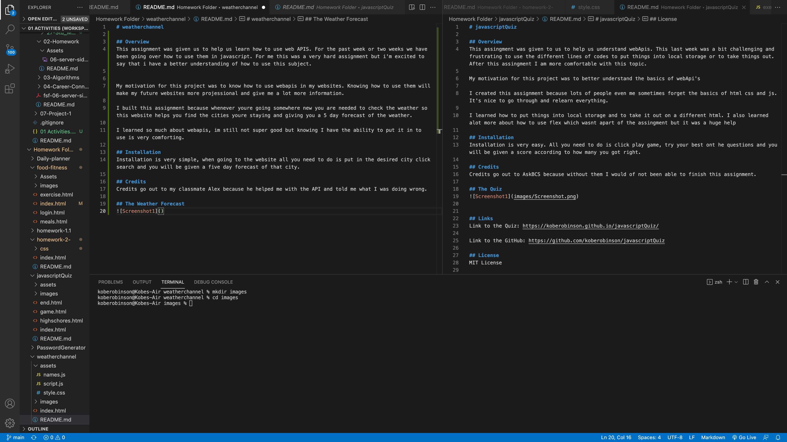

# weatherchannel

## Overview
This assignment was given us to help us learn how to use web APIS. For the past week or two weeks we have been going over how to use them in javascript. For me this was a very hard assignment but i'm excited to say that i have a better understanding of how to use this subject.

My motivation for this project was to know how to use webapis in my websites. Knowing how to use them will make my future websites more projessional and give me a lot more information.

I built this assignment because whenever youre going somewhere new you are needed to check the weather so this website helps you find the cities youre staying and giving you a 5 day forecast of the weather.

I learned so much about webapis, im still not super good but knowing I have the ability to put it in to use is very comforting.

## Installation
Installation is very simple, when going to the website all you need to do is put in the desired city click search and you will be given a five day forecast of that city.

## Credits
Credits go out to my classmate Alex because he helped me with the API and told me what I was doing wrong.

## The Weather Forecast

## Links
Link to the Weather Forecast: https://koberobinson.github.io/weatherchannel/

Link to the Repository: https://github.com/koberobinson/weatherchannel

## License
MIT License

Copyright (c) [2021] [Kobe Robinson]

Permission is hereby granted, free of charge, to any person obtaining a copy
of this software and associated documentation files (the "Software"), to deal
in the Software without restriction, including without limitation the rights
to use, copy, modify, merge, publish, distribute, sublicense, and/or sell
copies of the Software, and to permit persons to whom the Software is
furnished to do so, subject to the following conditions:

The above copyright notice and this permission notice shall be included in all
copies or substantial portions of the Software.

THE SOFTWARE IS PROVIDED "AS IS", WITHOUT WARRANTY OF ANY KIND, EXPRESS OR
IMPLIED, INCLUDING BUT NOT LIMITED TO THE WARRANTIES OF MERCHANTABILITY,
FITNESS FOR A PARTICULAR PURPOSE AND NONINFRINGEMENT. IN NO EVENT SHALL THE
AUTHORS OR COPYRIGHT HOLDERS BE LIABLE FOR ANY CLAIM, DAMAGES OR OTHER
LIABILITY, WHETHER IN AN ACTION OF CONTRACT, TORT OR OTHERWISE, ARISING FROM,
OUT OF OR IN CONNECTION WITH THE SOFTWARE OR THE USE OR OTHER DEALINGS IN THE
SOFTWARE.